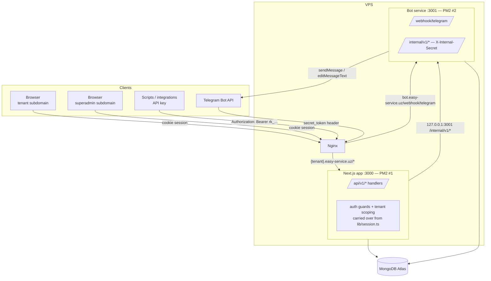
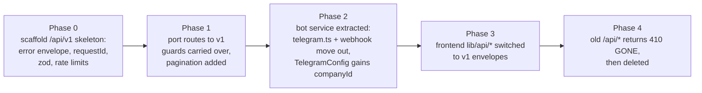

# API Design — assessment of the current API + design of the new v1 API

Related: [[MOC]] · [[API-Endpoints-Reference]] · [[Backend-and-Telegram-Bot]] · [[VPS-Setup-and-Cloudflare]] · [[MongoDB-Strategy]]

This document explains **why** the new API looks the way it does. The endpoint-by-endpoint contract lives in [[API-Endpoints-Reference]] — that reference is the living document to edit when an endpoint changes.

---

## 1. Current API — honest assessment

Surveyed from `src/app/api/**` (23 route files), `src/lib/session.ts`, `src/lib/telegram.ts`, and all 12 models. What exists today:

```
POST /api/auth/login            POST /api/auth/logout
GET|POST /api/companies         PUT|DELETE /api/companies/{id}        (superadmin)
GET|POST /api/hotels            PUT|DELETE /api/hotels/{id}           (owner)
GET|POST /api/admins            PUT|DELETE /api/admins/{id}           (owner)
GET|POST /api/rooms             PUT|DELETE /api/rooms/{id}            (owner writes)
PUT /api/rooms/reorder
GET|POST /api/services          GET|PUT|DELETE /api/services/{id}     (owner writes)
GET|POST /api/bookings          GET|PUT|DELETE /api/bookings/{id}     (owner+admin)
GET|POST /api/clients           PUT|DELETE /api/clients/{id}          (owner+admin)
GET|POST /api/client-groups     PUT|DELETE /api/client-groups/{id}    (owner writes)
GET|POST /api/contracts         PUT|PATCH|DELETE /api/contracts/{id}  (owner+admin)
GET /api/notifications
POST /api/telegram/webhook
```

### What's genuinely good (keep these patterns)

- **Consistent role guards.** Every route starts with `requireSuperadmin` / `requireOwner` / `requireAdmin` / `requireDashboard` from one shared module, returning a typed session or a ready 401/403 `Response`. One place to audit authorization.
- **Tenant scoping helpers.** `hotelScope()` / `idScope()` / `bookingIdScope()` build the Mongo filter from the session, so an admin physically cannot query outside their `companyId`/`hotelId`. Every query is tenant-filtered at the data layer, not just at the UI.
- **Plan-expiry write gate.** `requireWritable()` blocks all writes for a company whose plan expired while leaving reads open — a clean commercial control applied uniformly.
- **Privacy masking on shared services.** When hotels share one physical resource (pool, hall), other hotels see the slot as occupied but the guest's data is redacted (`maskBooking`). This is a real multi-tenant privacy feature, not just access control.
- **Server-side availability enforcement.** Capacity-aware overlap counting with before/after buffer times happens in the POST handler, so double-booking is rejected at the API even if the UI misbehaves.
- **Audit history on bookings** (`history[]` of created/paid/finished/rescheduled events with actor and timestamp).
- **Non-blocking notifications.** Telegram sends run in `after(...)` so a Telegram outage can never fail or slow a booking request.
- **Session security basics are right:** JWT in an `httpOnly` cookie, `SameSite=Lax`, `secure` in production, bcrypt cost 12, uniform "Invalid email or password" on all login failure paths (no account enumeration).

### What's wrong or missing (why we need a v1)

| # | Problem | Consequence |
|---|---------|-------------|
| 1 | **No versioning** — everything lives at `/api/*` with no `v1` | Any breaking change silently breaks every client; there is no way to run old and new contracts side by side during a migration |
| 2 | **`TelegramConfig` is a global singleton** — `TelegramConfig.findOne()` with **no `companyId`**; one group chat serves the whole platform, and any owner running `/login` in Telegram overwrites it (`deleteMany({})` then `create`) | ⚠️ **Multi-tenant bug**: with 2+ companies, Company B's bookings post into Company A's Telegram group, and each owner login steals the config from the previous one. Must become per-company before onboarding a second real tenant |
| 3 | **No pagination** on any list endpoint (bookings has only a bare `limit`) | Every list is "return the whole collection" — fine at demo scale, degrades linearly with real data; a year of bookings = one giant JSON response |
| 4 | **Ad-hoc error shape** — `{ error: "some English sentence" }`, no machine-readable code | Clients must string-match to distinguish "slot full" from "plan expired" from "validation failed"; the UI already ships these strings to `showToast` untranslated |
| 5 | **Mixed REST semantics** — some resources have no `GET /{id}`; `rooms/reorder` is an RPC verb; contracts use both PUT and PATCH; booking state changes (pay/finish/cancel) are all overloaded into one `PUT /bookings/{id}` | Harder to document, harder to authorize per-action, and the PUT handler is a 175-line if-forest |
| 6 | **Cookie-session auth only** — no API keys / bearer tokens | Nothing programmatic can call the API: no integrations, no scripts, and the split bot service ([[Backend-and-Telegram-Bot]]) has no way to call back into the app |
| 7 | **Sessions are irrevocable** — stateless 7-day JWT; deleting an admin doesn't kill their live session | A fired admin keeps working access for up to 7 days unless the secret is rotated (which logs everyone out) |
| 8 | **Manual per-route validation** — hand-rolled `typeof` checks, inconsistent between routes | Validation gaps (e.g. no max-length checks anywhere), and no single source of truth for request shapes |
| 9 | **No request IDs / structured logging** — `console.error(err)` only | Production debugging across two services (app + bot) with no correlation ID is guesswork |
| 10 | **No app-level rate limiting** — login brute-force protection depends entirely on Cloudflare rules being configured | Defense-in-depth gap; one misconfigured Cloudflare rule and login is wide open |
| 11 | **Telegram logic lives inside the web app** (`lib/telegram.ts`, webhook route, topic sync loops) | Exactly what [[Backend-and-Telegram-Bot]] decided to split out; `syncAllTopics()` even iterates `Service.find()` with **no tenant filter** — same singleton-era assumption as #2 |

**Bottom line:** the authorization core (guards + scoping helpers) is solid and carries over almost unchanged. What v1 adds is *contract discipline* (versioning, error codes, pagination, validation) and *reach* (API keys, the bot service, per-company Telegram), plus fixing the two places where the code still assumes a single tenant (#2, #11).

---

## 2. New architecture — two services, one contract

Decisions already made in [[Backend-and-Telegram-Bot]] and [[VPS-Setup-and-Cloudflare]]: Next.js app + separate bot service on one VPS, subdomain-per-owner routing, Cloudflare in front.



**Ownership boundaries — who may do what:**

| Concern | Next.js app | Bot service |
|---|---|---|
| All business logic (bookings, availability, payments, contracts…) | ✅ sole owner | ❌ never |
| Rendering Telegram messages + topics | ❌ (moves out) | ✅ sole owner |
| Telegram Bot API calls (token holder) | ❌ token not in its env | ✅ only holder of `TELEGRAM_BOT_TOKEN` |
| MongoDB writes | ✅ full app user | Only `telegramconfigs`, `telegramtopics`, `telegramsessions`, plus `tgChatId/tgMessageId/tgThreadId` on bookings (least-privilege DB user, per [[MongoDB-Strategy]]) |
| Receiving Telegram updates (webhook) | ❌ | ✅ |
| Triggering a notification | ✅ calls bot's internal API | executes it |

The app never blocks on the bot: notification calls stay in `after(...)` (or a fire-and-forget with retry), preserving today's "Telegram can't break a booking" property.

---

## 3. Contract conventions (apply to every endpoint)

These are the rules; [[API-Endpoints-Reference]] assumes them everywhere.

### 3.1 Base URL & tenancy

- Tenant API: `https://{company-slug}.easy-service.uz/api/v1/...` — **tenant identity comes from the subdomain** (Host header), resolved by middleware, and must match the session's `companyId`. A valid session cookie presented on the *wrong* company's subdomain is rejected with `403 TENANT_MISMATCH`. This kills the current pattern of carrying slugs in both the path and the session.
- Superadmin API: `https://superadmin.easy-service.uz/api/v1/...` — platform-level endpoints exist *only* on this host; requesting them from a tenant subdomain is a 404.
- Bot service: not publicly routed except `POST /webhook/telegram` (via `bot.easy-service.uz` or a path route — Nginx decision, see [[VPS-Setup-and-Cloudflare]]). Everything else on the bot binds to `127.0.0.1:3001`.

### 3.2 Authentication

Two credential types, one per client class:

1. **Session cookie** (browsers) — same JWT design as today (`httpOnly`, `SameSite=Lax`, `secure`, 7d) **plus a `sessionVersion` claim**: each Admin document gets a `sessionVersion: number`; bumping it (on password change, on deactivation, on "log out everywhere") invalidates all outstanding JWTs for that user at guard time. Fixes current-API problem #7 with one indexed field read.
2. **API key** (programmatic) — `Authorization: Bearer rk_live_...`. Keys are issued per company by the owner (or per platform by superadmin), stored **hashed** (SHA-256) with only a `rk_live_xxxx…` prefix shown after creation, carry a role (`owner`-equivalent or read-only) and the same `companyId` scoping as a session. This is also how any future integration authenticates.

The internal app→bot channel uses neither: a static `X-Internal-Secret` header over loopback (see [[Backend-and-Telegram-Bot]]).

### 3.3 Error envelope

Every non-2xx response, from both services:

```json
{
  "error": {
    "code": "SLOT_FULL",
    "message": "This time slot is fully booked for this service.",
    "details": { "serviceId": "665f...", "date": "2026-07-15" }
  },
  "requestId": "req_01J9ZK3T8Q"
}
```

- `code` — stable UPPER_SNAKE identifier; **clients branch on this, never on `message`**. Full catalog in [[API-Endpoints-Reference]] §1.
- `message` — human-readable English; the UI maps `code` → its own i18n strings (fixes the untranslated-toast problem at the root).
- `requestId` — generated in middleware, echoed in an `X-Request-Id` response header, logged by both services. One ID follows a booking from HTTP request → app log → bot log → Telegram send.

### 3.4 Pagination, filtering, sorting

- List endpoints take `?page=1&limit=25` (max `limit=100`) and respond with an envelope:
  ```json
  { "data": [ ... ], "meta": { "page": 1, "limit": 25, "total": 312, "totalPages": 13 } }
  ```
- Sorting: `?sort=-createdAt` (leading `-` = descending). Each endpoint whitelists its sortable fields.
- Filters are endpoint-specific query params, documented per endpoint.
- **Exception:** small, bounded collections (hotels, client-groups, a company's admins) return plain arrays — pagination there is ceremony without benefit.

### 3.5 Field & format conventions

- IDs are Mongo ObjectId strings; timestamps are ISO-8601 UTC; calendar dates stay `"YYYY-MM-DD"` strings and times `"HH:mm"` (matching the existing models — these are *wall-clock hotel-local values*, deliberately not timezone-shifted).
- Request bodies are validated with **zod schemas shared in one module per resource** — the schema is the single source of truth, and the same types feed the client `lib/api/*` wrappers. Validation failure → `422 VALIDATION_FAILED` with per-field `details`.
- Booking **state transitions become sub-resource POSTs** (`/bookings/{id}/payments`, `/cancel`, `/finish`, `/reopen`) instead of one overloaded PUT — each transition gets its own guard, validation, audit event, and Telegram edit. `PUT /bookings/{id}` keeps only *data* edits (reschedule, notes, party size…).

### 3.6 Idempotency & concurrency

- `POST /bookings` accepts an optional `Idempotency-Key` header (client-generated UUID, stored 24h): a retried request (mobile network, double-tap) returns the original booking instead of creating a duplicate or a spurious `SLOT_FULL`.
- The overlap-count availability check moves inside a **MongoDB transaction** (supported on Atlas replica sets, per [[MongoDB-Strategy]]) so two concurrent requests can't both pass the count and double-book the last slot — today's check has this race.

### 3.7 Rate limiting (app-level, on top of Cloudflare)

| Class | Limit | Applies to |
|---|---|---|
| Auth | 5/min per IP + per email | `POST /auth/login` (both hosts) |
| Writes | 60/min per session/key | all POST/PUT/PATCH/DELETE |
| Reads | 300/min per session/key | all GET |

Enforced in middleware with an in-memory token bucket (single VPS = no shared store needed yet); returns `429 RATE_LIMITED` with `Retry-After`.

---

## 4. Migration path (old API → v1)

The old `/api/*` routes keep working while v1 is built — nothing breaks mid-migration.



Order rationale: the **TelegramConfig-per-company fix (#2) rides along with the bot extraction** in Phase 2 because both touch the same three models — do them together, migrate the one existing config document by stamping it with the demo company's `companyId`.

Two things are explicitly **out of scope for v1** (documented so they're a decision, not an omission): outbound webhooks to customer systems (`booking.created` events pushed to a URL the owner registers) and a public read-only availability API for embedding a booking widget — both are natural v1.1 candidates and the conventions above (API keys, error codes, versioning) are designed so they can be added without breaking anything.
