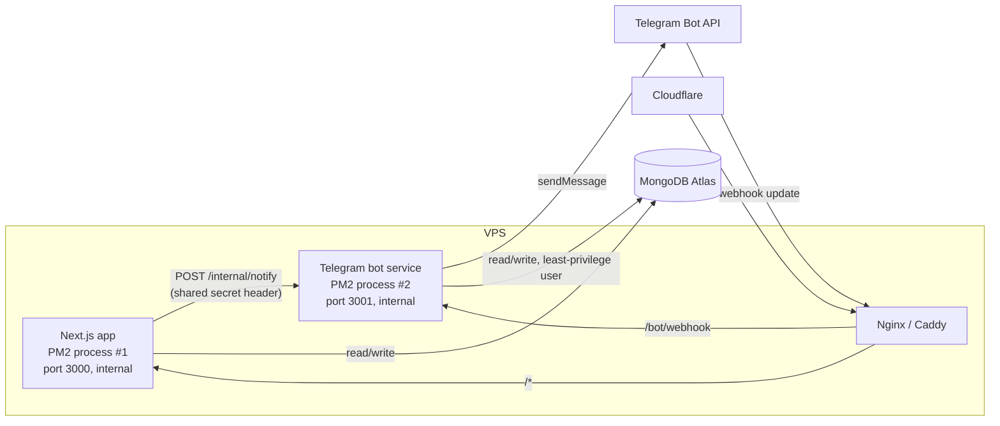
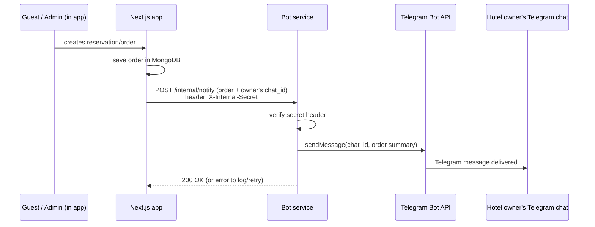

# Backend split — Telegram order-notification bot as its own service

Related: [[MOC]] · [[VPS-Setup-and-Cloudflare]] · [[MongoDB-Strategy]]

## 1. Decision: separate process, not inside the Next.js app

The bot moves out of Next.js into its own small Node service, running as its own PM2 process on the VPS. Reasoning:

- Next.js is a request/response web framework. A bot that needs to run continuously (or at least reliably receive/send messages independent of web traffic) doesn't belong in the same process lifecycle as page rendering — a slow deploy/restart of the web app shouldn't interrupt bot delivery, and vice versa.
- Keeping it separate means it can be restarted, redeployed, and scaled independently, and a bug in bot logic can't take down the dashboard.
- It's a small enough service that this doesn't add much operational overhead — one extra PM2 entry, one extra small codebase.

## 2. Webhook vs long-polling — use webhook

Two ways a Telegram bot receives updates:

- **Long-polling:** the bot process calls Telegram in a loop asking "any updates?" — this needs the process to be always-on and doesn't need a public HTTPS endpoint, but it's a worse fit once you're already running behind Cloudflare with a real domain.
- **Webhook:** Telegram pushes each update to a URL you register once (`https://easy-service.uz/bot/webhook` or a dedicated `bot.easy-service.uz`) — simpler to reason about, lower resource use, and fits naturally with the Nginx reverse-proxy setup already planned in [[VPS-Setup-and-Cloudflare]].

Since you already have a domain + reverse proxy on the VPS, **webhook mode is the better fit** — register the webhook once with `setWebhook`, and the reverse proxy routes that specific path to the bot service instead of the main app.

Secure the webhook endpoint:
- Use Telegram's `secret_token` parameter on `setWebhook`, and verify the `X-Telegram-Bot-Api-Secret-Token` header on every incoming request — rejects anything that isn't actually from Telegram.
- Don't expose the bot token anywhere in a URL path; keep the webhook path itself unguessable (a random path segment) as a second layer, on top of the secret-token check.

## 3. How the app and the bot talk to each other

Two integration options were considered:

| Option | How it works | Trade-off |
|---|---|---|
| **A. Internal HTTP call** (recommended to start) | Next.js calls `POST http://127.0.0.1:3001/internal/notify` (bot's internal port, not exposed publicly) with order details, right when an order/reservation is created | Simple, synchronous, easy to reason about; if the bot process is briefly down, that one notification could be lost unless you add a retry |
| **B. Shared DB / polling** | Bot service polls MongoDB for new/unsent orders on an interval and marks them sent | Decouples the two completely (app doesn't need to know the bot exists), but adds polling delay and another place tracking "sent" state |
| **C. Queue (Redis/BullMQ)** | App pushes a job, bot worker consumes it | Most robust against bot downtime (jobs persist and retry), but is real infra to run and operate for a problem that doesn't need it yet |

**Recommendation: start with A** (direct internal HTTP call, protected by a shared secret header, e.g. `X-Internal-Secret`). It's the least amount of new infrastructure, and matches the actual requirement ("send orders" notifications) without over-building for scale you don't have yet. Only move to option C (a real queue) if you start seeing notifications silently dropped because the bot process was down at the exact moment an order came in — that's a concrete, observable pain worth solving with more infra, not a hypothetical one.

## 4. Order-notification flow

Each owner/company needs a stored `telegramChatId` (set once, e.g. when the owner starts a chat with the bot and it captures their chat ID via a `/start` command handled through the same webhook) so the bot knows where to deliver that tenant's notifications — this ties back into the multi-tenant model in [[MongoDB-Strategy]].

## 5. Security specifics for the bot service

- **Bot token** lives only in the bot service's environment on the VPS — never in the Next.js app's env, never committed, never logged.
- **Internal-only ports:** both the app (3000) and bot (3001) bind to `127.0.0.1`, not `0.0.0.0` — only Nginx can reach them, matching the pattern in [[VPS-Setup-and-Cloudflare]].
- **Shared secret** between app → bot internal calls, rotated if ever exposed, checked on every request before processing.
- **Least-privilege DB user** for the bot (per [[MongoDB-Strategy]]) — it typically only needs read access to orders/owners and write access to a "notification sent" flag; it should not have the same broad permissions as the main app's DB user.
- **PM2-managed, independent process** — separate `pm2` entry, separate log file, restarts independently of the web app so a bot crash/update never takes the dashboard down and vice versa.

## Checklist
- [ ] Scaffold bot service (grammY or Telegraf) as its own package/process
- [ ] Register webhook with `secret_token`, route `/bot/webhook` via Nginx to the bot's internal port
- [ ] Add `telegramChatId` field to the owner/company model, capture it via `/start`
- [ ] Implement `POST /internal/notify` on the bot, guarded by a shared secret header
- [ ] Wire the Next.js order-creation path to call that internal endpoint
- [ ] PM2 entry for the bot service, internal-only port, own log file
- [ ] Separate least-privilege MongoDB user for the bot
