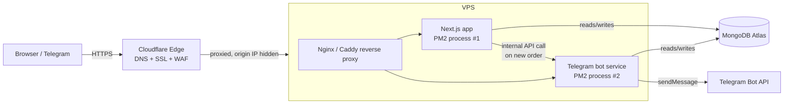

# MOC — Production Rollout Plan (VPS, Cloudflare, MongoDB, Backend)

**Goal:** move ReserveDesk from local/dev into production on a VPS, put it behind Cloudflare using a real domain (`easy-service.uz`) with per-owner subdomains, decide where MongoDB should live, and split the Telegram order-notification bot out of the Next.js app into its own backend service.

## Documents in this plan
- [[VPS-Setup-and-Cloudflare]] — domain, wildcard subdomains, SSL, firewall, process management, request flow
- [[MongoDB-Strategy]] — Atlas vs self-hosted, security, backups, environment separation
- [[Backend-and-Telegram-Bot]] — splitting the bot into its own service, webhook vs polling, order-notification flow
- [[API-Design]] — honest assessment of the current API (pros/cons, incl. the TelegramConfig multi-tenant bug), conventions for the new v1 (auth, errors, pagination, idempotency), migration phases
- [[API-Endpoints-Reference]] — the living contract: every v1 endpoint (app + bot service) with auth, request/response shapes, and error codes — edit this doc first when an endpoint changes

## The shape of the system (high level)

## Subdomain model (recap of the decision made in chat)
- `superadmin.easy-service.uz` — static, superadmin login only.
- `{owner-slug}.easy-service.uz` — one per company/owner (e.g. `safir-group-mchj.easy-service.uz`), created the moment a superadmin adds a new owner — **no DNS action needed per owner**, a single wildcard DNS record covers all of them.
- Same subdomain serves both **owner** and **admin** logins for that company — the app resolves which company from the `Host` header, then the login form just checks which role the credentials belong to.

## Open decisions to confirm before executing
- [ ] Final domain: `easy-service.uz` (confirm registrar/DNS access is ready to point at Cloudflare)
- [ ] VPS provider + specs (confirm before sizing PM2/Mongo/Nginx config)
- [ ] Whether bot and app share one MongoDB user or get separate least-privilege users (see [[Backend-and-Telegram-Bot]])
