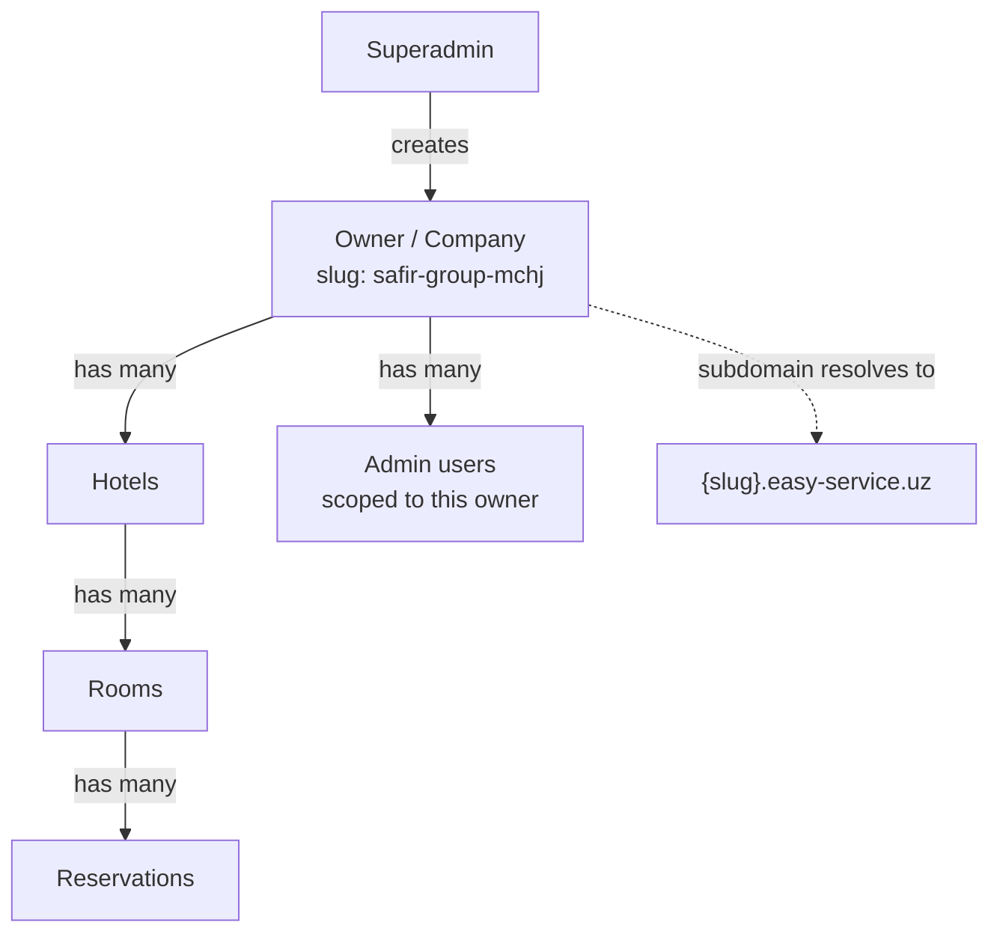

# MongoDB Strategy — Atlas vs self-hosted, Mongo vs Postgres, environments

Related: [[MOC]] · [[VPS-Setup-and-Cloudflare]] · [[Backend-and-Telegram-Bot]]

## 1. Decision: stay on MongoDB, don't switch to Postgres

ReserveDesk already has working schemas, seed scripts, and a live multi-tenant model (superadmin → owner/company → hotel → admin → reservations) built on MongoDB/Mongoose. Switching the primary data store to Postgres now would mean rewriting the whole data layer and every migration for uncertain benefit.

MongoDB is a reasonable fit for this shape of data:
- Naturally hierarchical documents (company → hotels → rooms → reservations) instead of many join tables.
- Multi-document ACID transactions have been supported since MongoDB 4.0, so "don't double-book a room" style consistency is achievable when needed — it's not a hard blocker.

**Revisit this only if** a concrete pain shows up later — e.g. heavy cross-entity reporting/joins across owners, or real data-integrity bugs traceable to the lack of foreign-key constraints. Don't switch preemptively.

## 2. Decision: MongoDB Atlas (managed), not self-hosted on the VPS

| | Atlas (managed cloud) | Self-hosted on the VPS |
|---|---|---|
| Backups | Automated, continuous, point-in-time recovery | You build and test this yourself |
| High availability | Replica set + automatic failover included | You configure and maintain replica sets |
| Security patching | Handled by Atlas | You patch MongoDB yourself, on schedule |
| Cost | Free/shared tier (M0/M2) works for current scale | "Free" but real ops time cost |
| Blast radius if VPS dies | App is down, data is safe elsewhere | App AND data are gone together |

This is a hotel-booking system — real bookings, real customer PII, real money implications if data is lost or double-booked. The risk of a single VPS being both the app server and the only copy of the database is the deciding factor: **keep Mongo on Atlas.** The free/shared tier is enough to start; upgrade the tier as load grows, no migration needed since it's the same MongoDB.

**One latency note:** pick the Atlas region closest to (ideally same cloud region/provider as) the VPS, so every query doesn't pay cross-region round-trip latency.

## 3. Current state to fix before going to production

From the existing setup: `.env.local` currently points at the **production** MongoDB cluster (`main.stgzkab.mongodb.net`, database `test`). Every script under `src/scripts/` (`seed-demo.ts`, `seed-admin.ts`, `seed-data.ts`, `seed-rooms.ts`, `seed-superadmin.ts`, `migrate-company.ts`) reads `MONGODB_URI` from that same file, so anything run locally operates against production data.

Checked the actual scripts rather than assuming: `seed-demo.ts` is scoped — it only deletes and recreates the one demo-tenant company (matched by `companyId`), it does not wipe the whole database. None of the other scripts do broad deletes either. So the blast radius of an accidental local run is smaller than "wipes prod" — but it's still real: `migrate-company.ts` and the admin/superadmin seed scripts write directly into production, and running the wrong script against the wrong assumption is exactly the kind of mistake that's easy to make when dev and prod share one `.env.local`.

- [ ] Create **separate Atlas clusters or at least separate databases** for `development` and `production`.
- [ ] Rename the production database away from the placeholder name `test` to something explicit like `reservedesk_prod`.
- [ ] `.env.local` (used for local dev) should point at a **dev** database only — never at prod.
- [ ] Production credentials/connection string should live only in the VPS's environment (PM2 env file / systemd env / secrets manager), never committed, never in a file a dev script defaults to.
- [ ] Add a production guard shared across `src/scripts/*.ts` (e.g. refuse to run if the resolved DB name matches the prod pattern, or require an explicit `--yes-i-mean-prod` flag) as a last line of defense — cheap insurance even though today's scripts are more scoped/careful than assumed.

## 4. Security checklist for the Atlas cluster

- **Network access:** restrict Atlas's IP allowlist to the VPS's outbound IP only (not `0.0.0.0/0`). If the bot service in [[Backend-and-Telegram-Bot]] runs on the same VPS, it shares that same IP allowlist entry.
- **Least-privilege DB users:** separate database users per purpose — e.g. one `app` user with read/write on the app's collections, a separate narrower user for the bot service if it only needs to read reservations/write notifications-sent flags, and a distinct admin user (used manually, not embedded in any running service) for migrations/seeding.
- **Strong, unique passwords** per DB user, stored as environment secrets, rotated if anyone with access leaves the project.
- **Encryption at rest** is on by default on Atlas — no action needed, just confirm it's not disabled.
- **Point-in-time recovery / continuous backups** — enable on the production cluster; this is what actually saves you from an accidental `seed-owner.ts` run or a bad migration, on top of fixing the root cause above.
- **Audit logging** (Atlas paid tiers) — worth turning on once there's real customer data, to have a trail of who accessed/changed what.

## 5. Data model shape (for reference)

Index recommendations: ensure the owner `slug` field has a unique index (it's effectively your tenant router key now — see [[VPS-Setup-and-Cloudflare]]), and that all tenant-scoped collections (hotels, rooms, reservations, admins) are indexed on their owner/company reference field, since every query in a multi-tenant system should be filtering by tenant first.

## Checklist
- [ ] Split dev/prod databases; rename prod DB off `test`
- [ ] Add a shared production-guard to `src/scripts/*.ts`
- [ ] Move prod Mongo URI out of any file used by local dev scripts
- [ ] Atlas network access restricted to VPS IP
- [ ] Separate least-privilege DB users (app, bot, admin/migrations)
- [ ] Continuous backups / point-in-time recovery enabled
- [ ] Unique index on owner `slug`, tenant-reference indexes on child collections
