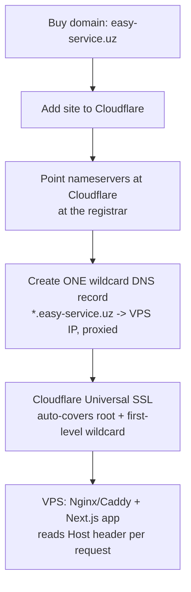
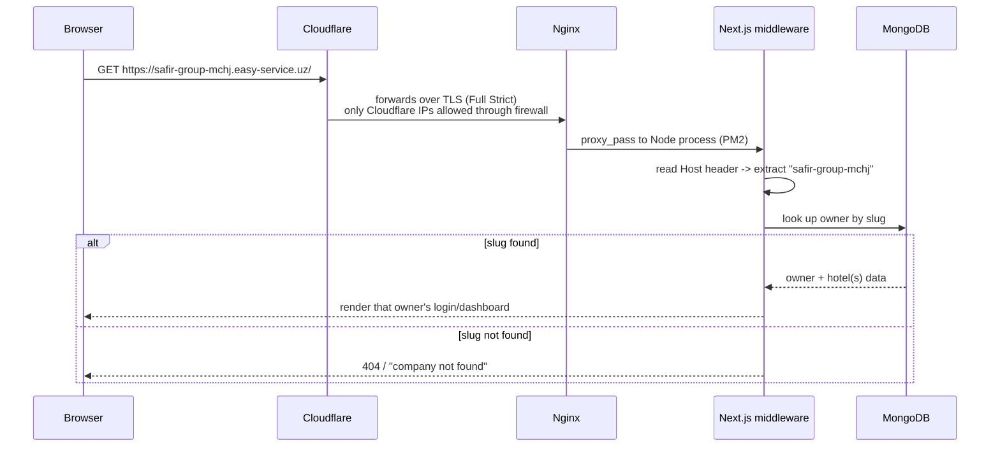

# VPS Setup + Cloudflare (domain, subdomains, SSL, security)

Related: [[MOC]] · [[MongoDB-Strategy]] · [[Backend-and-Telegram-Bot]]

## 1. What we're building

One domain, `easy-service.uz`, in front of one VPS. Every company (owner) gets its own subdomain automatically, without us touching DNS every time a new owner signs up. Cloudflare sits in front of the VPS for DNS, SSL, and basic protection; the VPS runs the actual Next.js app (and, per [[Backend-and-Telegram-Bot]], a separate bot process).

## 2. DNS — why a wildcard record is enough

We do **not** need to call the Cloudflare API to create a subdomain every time a new owner is added. DNS wildcards already solve this:

| Record | Type | Value | Proxy |
|---|---|---|---|
| `easy-service.uz` | A | `<VPS_IP>` | Proxied (orange cloud) |
| `*.easy-service.uz` | A | `<VPS_IP>` | Proxied (orange cloud) |

That single wildcard resolves `superadmin.easy-service.uz`, `safir-group-mchj.easy-service.uz`, and every future owner slug the same way. When a superadmin creates a new owner in the app, all that happens is: a new row/document is saved with `slug: "safir-group-mchj"` — the subdomain "exists" the instant that row exists, because DNS already answers for it.

**Consequence to design for:** because the wildcard matches *any* subdomain, typos or unregistered slugs (`random-thing.easy-service.uz`) will still hit your app. Middleware must look up the slug and return a clean 404/"company not found" page rather than assuming it's always valid.

## 3. SSL / TLS

- Cloudflare's free **Universal SSL** automatically covers the root domain and one level of wildcard (`*.easy-service.uz`), so every owner subdomain gets HTTPS with zero extra certificates to manage.
- Set the Cloudflare SSL/TLS mode to **Full (Strict)**, not "Flexible." Flexible means Cloudflare↔origin traffic is unencrypted HTTP — fine for a demo, not for a system handling login sessions and reservation data.
- For Full (Strict) you need a certificate on the VPS itself. Easiest path: generate a **Cloudflare Origin CA certificate** (free, 15-year validity, issued from the Cloudflare dashboard) and install it in Nginx/Caddy. This certificate is only trusted by Cloudflare, which is fine — the browser never talks to it directly, all public traffic terminates at Cloudflare's edge.

## 4. Security hardening on the VPS

This is the part that matters most once real customer data (reservations, PII, login credentials) is involved:

- **Hide the origin IP.** Keep every DNS record proxied (orange cloud) — never grey-cloud (DNS-only) a record that points at the same VPS, or the real IP leaks and attackers can bypass Cloudflare entirely.
- **Firewall the origin to Cloudflare only.** Configure `ufw` (or your cloud provider's security group) so ports 80/443 only accept connections from [Cloudflare's published IP ranges](https://www.cloudflare.com/ips/). This is the single biggest thing that makes "hide the IP" actually enforceable instead of just obscurity.
- **SSH hardening:** key-only auth (disable password auth), disable root login over SSH, keep a non-standard SSH port only if you also keep fail2ban running (security through obscurity alone isn't enough).
- **fail2ban** on SSH and on Nginx auth-failure logs to auto-block brute-force attempts.
- **Cloudflare WAF / rate limiting:** turn on the free managed ruleset, and add a rate-limit rule on login routes (e.g. `/api/auth/*`, and whatever path each subdomain's login form posts to) to blunt credential-stuffing attempts — this matters more than usual here since you have many tenants (owners) each with their own login.
- **Unattended security updates** (`unattended-upgrades` on Ubuntu/Debian) so the OS/kernel gets patched automatically.
- **Automated VPS-level backups/snapshots** through your VPS provider, independent of the MongoDB backup strategy in [[MongoDB-Strategy]] — this covers your app code, Nginx config, PM2 setup, env files, etc., not just the database.

## 5. Request flow once it's all in place

## 6. Process management on the VPS

- Run the Next.js app under **PM2** (or systemd) so it auto-restarts on crash and starts on boot. `pm2 startup` + `pm2 save` gives you boot persistence.
- Keep the app on an internal-only port (e.g. `127.0.0.1:3000`) — Nginx is the only thing that should be reachable from outside on 80/443; the Node process itself should not be exposed directly.
- Centralize logs (`pm2 logs`, or ship to a log file with rotation via `pm2-logrotate`) so auth failures and errors are traceable per tenant.
- Deploys: `git pull` → `npm run build` → `pm2 reload <app>` (reload, not restart, for near-zero-downtime if you get to multiple instances later — not required at current scale, but worth knowing).

## 7. Reserved subdomains / slug collisions

Because any string can become `{slug}.easy-service.uz`, maintain a reserved-word list in the app (not just in docs) that new owner slugs are checked against before creation: `superadmin`, `www`, `api`, `admin`, `bot`, `mail`, `static`, `cdn`, etc. Reject or auto-suffix collisions at owner-creation time.

## Checklist
- [ ] Buy `easy-service.uz`, point nameservers at Cloudflare
- [ ] Add root `A` record + wildcard `A` record, both proxied
- [ ] Set SSL/TLS mode to Full (Strict); install Cloudflare Origin CA cert on VPS
- [ ] `ufw` rules restricting 80/443 to Cloudflare IP ranges
- [ ] SSH key-only auth, fail2ban, unattended-upgrades
- [ ] Nginx/Caddy reverse proxy → Next.js on `127.0.0.1:3000`, PM2-managed
- [ ] Reserved-slug list enforced in owner-creation logic
- [ ] Cloudflare WAF managed ruleset + rate limit on auth routes
